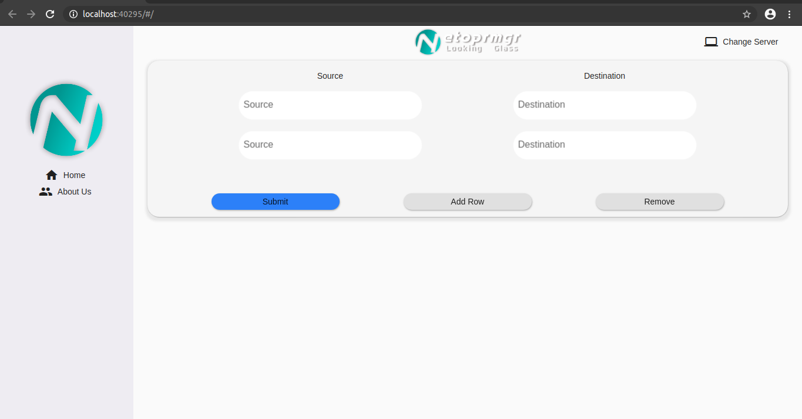

# netoprmgr_lg
Trace Route Application (Directly Remote Devices)

Hi All,

If you want to use this tools, please install Flutter and Flask(Python).

Open folder netoprmgr_lg_flask then take a look list_devices.py

For Now, you can add or change source and destination ip credential there.
